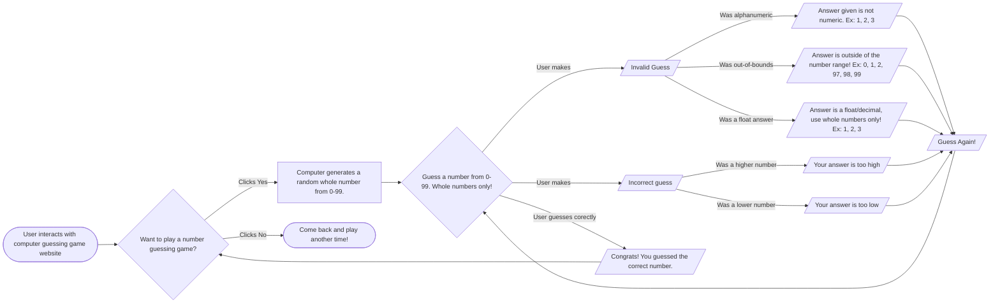

# Welcome to my guessing game flow chart!

## Here are the steps to the flow chart!
1. The user must first go to the website to access the game code.
2. The game code prompts the user to decide whether they would like to play the guessing game.
   1. If the user says no, that is the end of the game. The user is told to come back later and play.
   2. If the user says yes, the computer generates a random whole number from 0 to 99. The user now proceeds to step 3 (below).
3. The game now prompts the user to guess a number between 0-99.

   
   Three things can happen at this point:
   1. The user makes a correct guess. This shows the user a success message and then prompts them to the "Begin" screen, asking them if they want to play a guessing game. Giving them the choice to stay or leave, ending the game.
  
   2. The user makes an incorrect guess. This shows the user with 1 of 2 hints. They either guessed too high or too low. This output then sends them to the guessing screen again.  

   3. The user makes an invalid guess. This leads to 3 outcomes:
      1. The user makes some alphanumeric guess and then gets instructions on what a correct guess looks like. This prompts the "Question" screen afterward (to guess again).
      2. The user guessed outside of the bounds of the game's numbers. Again, they get instructions about what a correct guess looks like. This prompts the "Question" screen afterward (to guess again).
      3. The user made a float/decimal guess. The user is told only whole numbers can be guessed. This prompts the "Question" screen afterward (to guess again).
